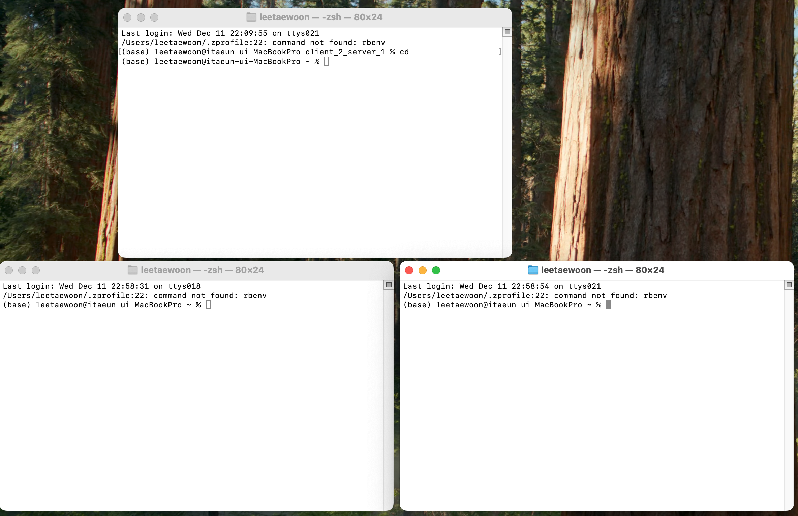
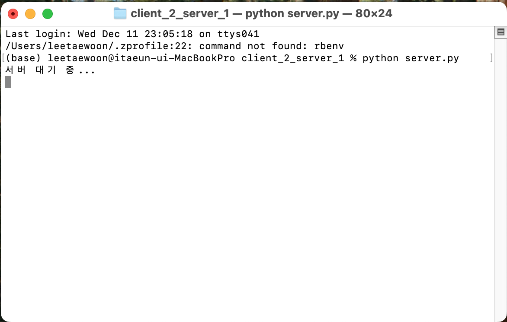
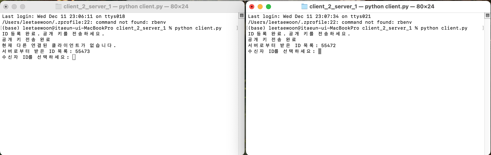
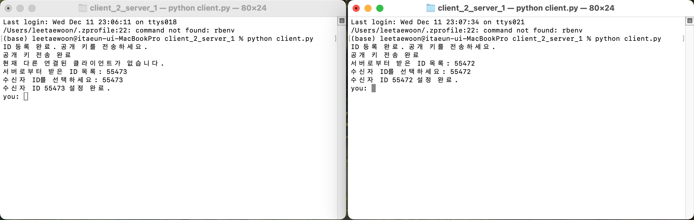
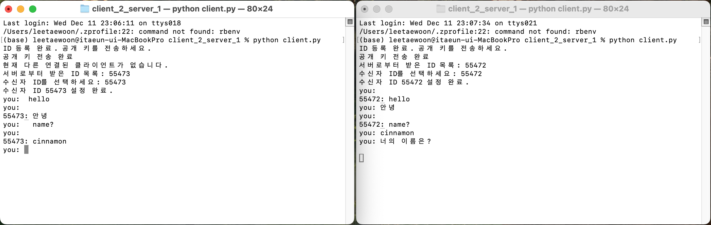
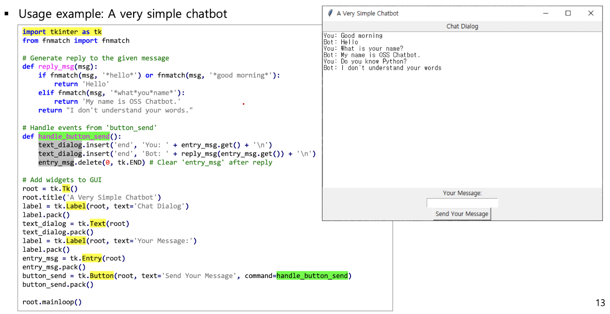

# Encrypted_chatting
## 목차
#### 1. 암호화 채팅이란?
#### 2. RSA 소개
#### 3. How to execute?
#### 4. 추가적으로 해보고 싶은 것

## 1. 암호화 채팅이란?
<figure>
    
    <figcaption>카카오톡</figcaption>
</figure>
<figure>
    
    <figcaption>텔래그램</figcaption>
</figure>

##### 카카오톡, 텔래그램과 같은 채팅 프로그램은 보안성 즉, 기밀성을 제공하기 위해 메시지를 raw data를 보내는 것이 아니라 암호화를 해서 보내게 됩니다.

##### OSS 수업에서 파이썬 툴을 배웠기 때문에, 이를 활용하여 암호화 채팅 프로그램을 만들어보고자 합니다.

## 2. RSA 소개
<figure>
    
    <figcaption>RSA</figcaption>
</figure>

이번에 사용한 암호알고리즘은 "RSA"입니다.  
RSA는 세상에 공개되는 공개키, 자기 자신만 알고 있는 비밀키로 구성됩니다.  
A라는 사람이 어떤 메시지 m을 공개키로 암호화하여 B에게 전송합니다.  
B는 그것을 받아 자기 자신만 알고 있는 비밀키로 풀게 되면,원본 메시지 m을 가지게 됩니다.  
이것은 마치 금고를 잠그는 키와 푸는 키가 다른 것으로 이해하면 됩니다.  

## 3. How to execute?
###### 윈도우환경도 똑같이 작동은 하나, 기본적으로 mac에서 작성하여 터미널 명령어가 다를 수 있습니다.

1. 터미널 창 3개 열기  

    기본적으로 네트워크를 통한 통신이어서, 개별 객체를 만들어주기 위해  
    서버용 터미널 1개, 클라이언트 2명 터미널 2개 총 3개가 필요합니다.

    
    이런식으로 저는 서버용 터미널은 맨 위,  
    클라이언트 1은 아래 왼쪽, 클라이언트 2는 아래 오른쪽에  
    각각 배치하였습니다.
2. 프로젝트 디렉토리 이동  
   
    모든 터미널에 이 명령어를 입력하여 프로젝트 디렉토리로 이동합니다.
    ```
    cd client_2_server_1
    ```
3. server.py 실행
    
    서버 터미널에 이 명령어를 실행시켜 줍니다.
    ```
    python server.py
    ```
    

4. client.py 실행
    
    클라이언트 터미널에 이 명령어를 *각각* 실행시켜 줍니다.
    ```
    python client.py
    ```
    
5. 클라이언트 연결하기  
   
   client.py에서 뜨는 "서버로부터 받은 ID 목록"은 자기 자신을 제외한 다른 ID를 표시합니다.  
   각각 표시된 번호를 입력해 줍니다.
   저는 왼쪽 터미널에서는 55473을, 오른쪽 터미널에서는 55472을 입력하도록 하겠습니다.
   
   이렇게 둘다 입력해 주면, 서로 연결되게 됩니다.
6. 그리고 채팅을 해봅시다.  
   
   
    한글, 숫자, 영어 다 입력이 가능합니다.
## 4. 추가적으로 해보고 싶은 것
원래는 여기가 기본이고, 수업시간에 배운 tkinter을 이용하여 채팅창을 만들어 보고 싶었습니다.  



본 프로젝트도 이 수업을 들으며 영감을 얻었습니다.  
하지만, 쓰레드에 대한 문제로 잘 작동하지 않았는데, 시간이 되면 tkinter를 이용해 gui도 만들어 보겠습니다.
